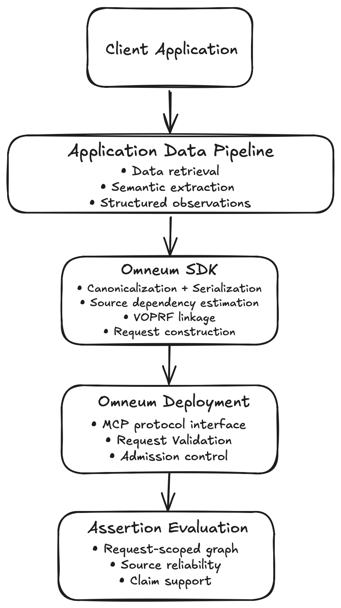

# Omneum Architecture

This document describes the high-level Omneum system architecture, including its runtime components, client-server boundary, request flow, and deployment model.

To see related specifications, visit:

- **[`sdk.md`](sdk.md)** — the application-facing Python interface and client-side processing performed by the SDK.
- **[`api.md`](api.md)** — the MCP tools, wire schemas, validation rules, resource limits, and assertion-evaluation semantics.
- **[`protocol.md`](protocol.md)** — the interoperability contract between clients and Omneum deployments, including protocol roles, trust boundaries, token identity, and key lifecycle.
- **[`canonicalization.md`](canonicalization.md)** — semantic canonicalization, strict serialization, and versioned linkage-input encoding.

## 1. Objectives

Omneum is a data trust gateway for agentic systems. It provides a protocol and runtime for evaluating structured assertions across multiple sources without exposing the underlying application data to the evaluator.

Omneum is designed to integrate with existing data and agent pipelines without requiring the deployment to ingest or interpret application content.

The architecture is guided by several core design principles:

- Application-specific extraction remains outside the Omneum runtime.
- Content-sensitive processing occurs client-side before data crosses the deployment boundary.
- VOPRF linkage replaces canonical application values with opaque protocol identifiers.
- Assertion evaluation is stateless and request-scoped.
- Client and deployment components communicate through a versioned protocol interface.
  
## 2. System Overview

At the highest level, Omneum is composed of three key architectural components:

- Omneum SDK
- Omneum Deployment
- Assertion Evaluation Engine

Applications integrate through the Omneum SDK using structured assertions, mapped retrieval or tool output, or the lower-level observation interface. The SDK converts these application-facing inputs into the common internal assertion representation, performs deterministic canonicalization and serialization, executes VOPRF linkage, estimates source dependency, constructs the protocol request, and submits it to an Omneum deployment.

An Omneum deployment validates the incoming request, constructs the request-scoped graph from opaque identifiers, executes the configured assertion-evaluation algorithm, and returns the protocol response. The deployment does not persist assertion graphs or evaluation state between requests.

  

  <em>Figure 1. High-level architecture of the Omneum system.</em>

## 3. Architectural Components

### 3.1 Omneum SDK

The SDK is the application-facing client. It exposes multiple integration paths for supplying information to be evaluated: client.evaluate() accepts an application-normalized StructuredAssertion, client.evaluate_mapped() adapts existing retrieval or tool output through a ContextMapper, and the lower-level client.evaluate_assertion() interface accepts Observation objects directly.
These interfaces converge on the same internal assertion-evaluation pipeline. The SDK performs deterministic canonicalization and serialization, VOPRF client operations, source-dependency estimation, request construction, response validation, and mapping between application-local values and opaque protocol identifiers. Application values remain client-side and are not included in assertion-evaluation requests.

### 3.2 Omneum Deployment

The deployment is the server-side protocol runtime. It exposes the MCP interface, maintains the active VOPRF server context, validates protocol requests, manages evaluation admission and resource limits, invokes the assertion-evaluation engine, and returns protocol responses.
Version 1 maintains no persistent assertion-evaluation state between requests.

### 3.3 Assertion Evaluation Engine

The assertion-evaluation engine is invoked by the deployment after request
validation. It consumes the validated assertion graph and source-pair inputs
and returns source-reliability scores, claim-support results, conflicts, and
evaluation metadata to the deployment.

The algorithm is versioned independently from the protocol and linkage
encoding.

## 4. End-to-End Workflow

This section describes the request path from application data to an assertion-evaluation response.

### 4.1 Application Integration

Omneum does not require the deployment to ingest or parse raw application data. The calling application retrieves information from its upstream systems and supplies it through one of the SDK's application-facing integration paths.
Applications that already have normalized entity, attribute, value, and source information can construct a StructuredAssertion directly. Existing retrieval or tool outputs can instead be adapted through a ContextMapper. Applications requiring direct control over the lower-level representation can supply Observation objects.
Upstream systems may include APIs, databases, documents, knowledge bases, MCP tools, or agent outputs. Semantic normalization—deciding which retrieved information represents the same entity, attribute, and structured value—remains application-defined rather than being inferred by the Omneum deployment.

### 4.2 Canonicalization

After the application-facing input has been converted into Omneum's structured assertion representation, the SDK canonicalizes its source, entity, attribute, and value fields according to the deterministic profiles defined by the canonicalization specification. Canonical values are then serialized into the fixed protocol schemas.
This processing occurs client-side before VOPRF linkage. Canonicalization normalizes representations within an already established semantic identity; it does not determine semantic equivalence between differently expressed application data

### 4.3 Privacy-Preserving Linkage

After serialization, the SDK domain-encodes source, attribute, and claim
payloads and performs the client side of the VOPRF protocol. The deployment
evaluates blinded elements using its active VOPRF key, while the SDK verifies
the returned proof and finalizes the resulting linkage tokens.

Assertion-evaluation requests contain the finalized tokens as opaque identifiers
rather than the canonical application values from which they were derived.

### 4.4 Assertion-Evaluation Request Construction

The SDK constructs an `evaluate_assertions` request from the generated linkage
tokens and locally computed source-pair inputs. The request contains the
complete assertion set, source-pair matrix, and protocol metadata required by
the wire contract.

### 4.5 Request Submission

The SDK submits the request to the Omneum deployment through the configured
transport. The version-1 reference implementation uses local MCP stdio. Remote
transport and Omneum Cloud are not currently implemented.

### 4.6 Assertion Evaluation

The deployment validates the request and constructs the request-scoped graph
from the submitted opaque identifiers. After validation and admission, it
invokes the configured assertion-evaluation algorithm.

Linkage tokens remain opaque to the deployment; the server does not resolve
them back to application values.

### 4.7 Evaluation Response

The deployment serializes the evaluation result into the versioned protocol
response and returns it to the SDK. The SDK validates the response metadata and
structure before mapping opaque identifiers back to application-local values.

## 5. Assertion Graph

Each `evaluate_assertions` request defines a complete request-scoped graph from
its submitted assertion triples. The deployment constructs this graph only
after protocol and topology validation.

### 5.1 Graph Structure

The graph is bipartite: source and claim nodes are connected by assertion
edges. Attribute identifiers group claims representing competing values for
the same application-defined property.

### 5.2 Graph Construction

The deployment constructs the graph directly from opaque `source_id`,
`attribute_id`, and `claim_id` values in the validated request. The graph
exists only for the lifetime of that evaluation and is discarded after the
request completes.

## 6. Deployment

### 6.1 Reference Implementation

The version-1 reference deployment is a local MCP server using stdio transport.
The server exposes `ping`, `evaluate_voprf`, and `evaluate_assertions`,
maintains the configured VOPRF server context, and executes assertion evaluation
through a bounded local executor.

Remote serving, persistent evaluation state, and multi-tenant Cloud
infrastructure are outside the current reference implementation.

### 6.2 Trust Boundary

The primary trust boundary lies between the SDK and the Omneum deployment.
Canonical application values, provenance inputs, source metadata, and VOPRF
client state remain on the client side of that boundary.

The deployment receives blinded elements during VOPRF evaluation and opaque
linkage tokens, numeric source-pair inputs, and protocol metadata during
assertion evaluation. It does not receive the canonical application values
represented by those tokens.

## 7. State Model

The version-1 deployment is stateless with respect to assertion evaluation.
Each request supplies the complete graph and source-pair matrix required for
execution.

The deployment retains only configured runtime state required to serve
requests, including the active deployment configuration and VOPRF server
context. Assertion graphs, blinded elements, proofs, finalized tokens, and
evaluation results are not persisted between calls.

Application-local mappings between protocol identifiers and canonical values
remain owned by the SDK or calling application.